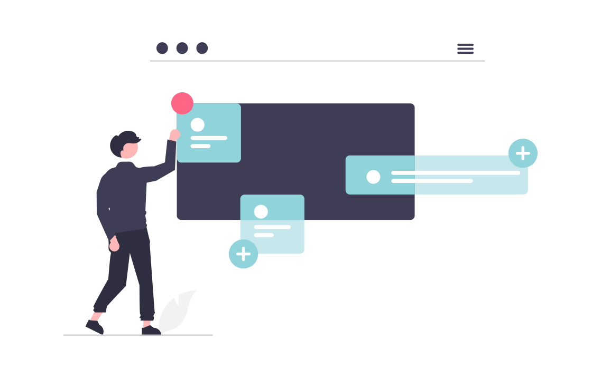

<ul class="breadcrumb">
  <li><a href="./#" class="icon fa-home">  Home</a></li>
  <li><a href="./#portfolio" class="icon fa-th">  Portfolio</a></li>
  <li>Blogs</li>
</ul>

### Context
Writing blog posts is not part of my day-to-day tasks and I do not have any significant experience with it. On top, I've always had a hard time deciding on a topic for writing a blog post. However, in the rare cases I've had the chance to write a blog post, I've really enjoyed the process. Hence, I'm saving a link to every blog post I write on this page as they are all somehow special to me.

### Links

- [Enable Blogging Capabilities with Material for MkDocs](https://www.dirigible.io/blogs/2021/11/2/material-blogging-capabilities/)
- [Dirigible now runs Material for MkDocs](https://www.dirigible.io/blogs/2021/11/1/dirigible-runs-material/)

<!-- ### [Grow As Tech Writer blog](grow-as-tech-writer-blog.html)
 I've also started my own blog as a way of challenging myself to go out of my comfort zone and do something I don't feel too confident about. It is already live and you can access it via the link above. Go check out the blogs I've already posted there.-->