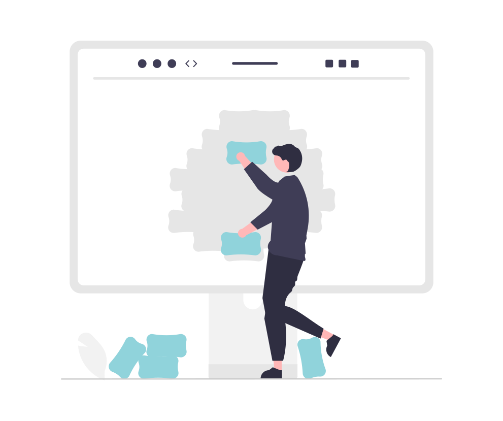

<ul class="breadcrumb">
  <li><a href="./#" class="icon fa-home">  Home</a></li>
  <li><a href="./#portfolio" class="icon fa-th">  Portfolio</a></li>
  <li>Documentation Homepage</li>
</ul>

### Context
[Eclipse Dirigible](https://www.dirigible.io/) is an application development platform that leverages in-system programming and rapid application development techniques to support a complete app development life cycle. I've supported the project for around 18 months, contributing and editing content in the [Eclipse Dirigible Documentation](https://www.dirigible.io/help/), adjusting documentation structure, updating screenshots, reviewing UI strings, writing blogs, testing code samples, and updating the documentation homepage's look and feel.

Although initially built with [Jekyll](https://jekyllrb.com/), at one point the team decided to move the project's main website ([https://www.dirigible.io/](https://www.dirigible.io/)), including [documentation](https://www.dirigible.io/help/), [blogs](https://www.dirigible.io/blogs/), and other subdomains to [MkDocs](https://www.mkdocs.org/) with [Material for MkDocs](https://squidfunk.github.io/mkdocs-material/). 

### My role

Shortly after I joined the Dirigible team and completed a couple of basic tasks such as language editing and proofreading of existing content to gain momentum, I jumped on my first more significant task. The documentation homepage represented a never-ending table of contents that was just mirroring the existing table of contents on the left. 

    

      

        
      

    

I had already thought about changing it to something more functional and modern-looking, so when the project moved from Jekyll to MkDocs, I offered the team to update the documentation homepage. I used the [Slack Help Center](https://slack.com/help) as an example of what features I'd like to have on the homepage:
- a search field
- tiles that link to important parts of the documentation 
- a visual hint for each tile
- some kind of animation for tiles on hover
- more context in addition to the main title of each tile

    

      

        
      

    

Once I had the requirements for the new homepage, I started working on it.

- Disabled table of contents and navigation for the homepage
- Wrote the HTML and CSS for the new homepage
- Added graphics

As a result, there was a re-styled homepage for the Dirigible documentation.

    

      

        
      

    

At a later stage, I presented the new homepage to colleagues as a part of an internal knowledge sharing session. I used the chance to ask user experience (UX) colleagues if they can take a look at the homepage design and suggest improvements. Based on UX recommendations, I adjusted the homepage a little bit. 

    

      

        
      

    

Currently, I'm not part of the project. Here's a link to check how the documentation homepage looks now: [Eclipse Dirigible Documentation](https://www.dirigible.io/help/).

### [Dirigible now runs Material for MkDocs](https://www.dirigible.io/blogs/2021/11/1/dirigible-runs-material/)
I also wrote a blog post to summarize the look and feel changes across the Dirigible landscape. Check it out via the link above.

### Tools

- VS Code
- Bash
- Git and GitHub
- Snagit
- MkDocs and Material for MkDocs
- [W3schools](https://www.w3schools.com/) for learning HTML/CSS and trying out things on the go