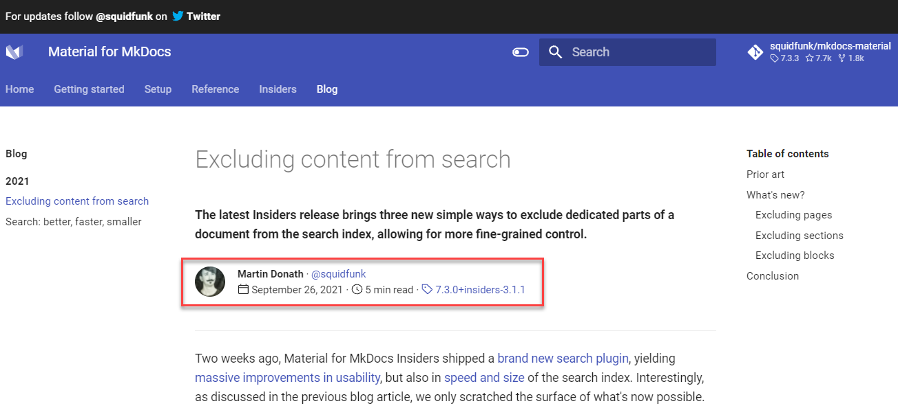
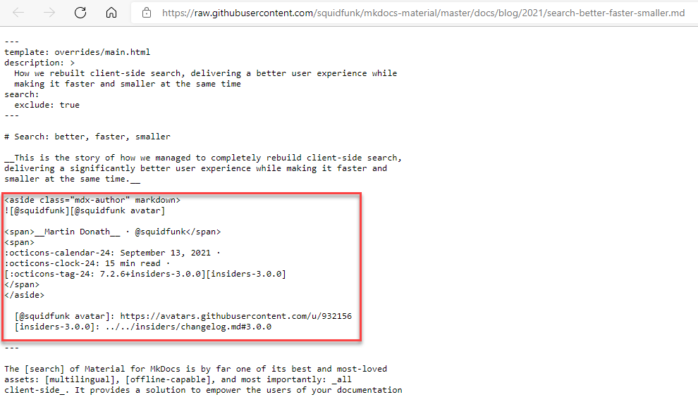
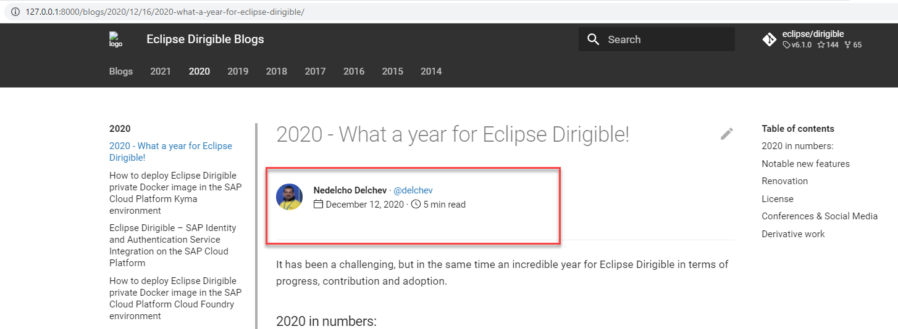
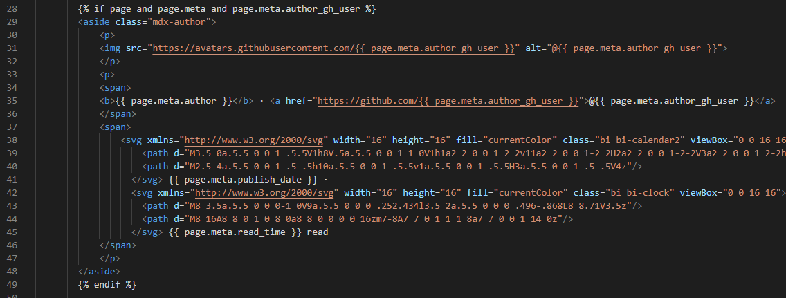

<ul class="breadcrumb">
  <li><a href="./#" class="icon fa-home">  Home</a></li>
  <li><a href="./#portfolio" class="icon fa-th">  Portfolio</a></li>
  <li>Enable Blogging in MkDocs</li>
</ul>


### Context
[Eclipse Dirigible](https://www.dirigible.io/) is an application development platform that leverages in-system programming and rapid application development techniques to support a complete app development life cycle. I've supported the project for around 18 months, contributing and editing content in the [Eclipse Dirigible Documentation](https://www.dirigible.io/help/), adjusting documentation structure, updating screenshots, reviewing UI strings, writing blogs, testing code samples, and updating the documentation homepage's look and feel.

Although initially built with [Jekyll](https://jekyllrb.com/), at one point the team decided to move the project's main website ([https://www.dirigible.io/](https://www.dirigible.io/)), including [documentation](https://www.dirigible.io/help/), [blogs](https://www.dirigible.io/blogs/), and other subdomains to [MkDocs](https://www.mkdocs.org/) with [Material for MkDocs](https://squidfunk.github.io/mkdocs-material/). 

### My role

At this point, Material for MkDocs did not support blogging capabilities out-of-the-box. While exploring the Material for MkDocs' site, I saw a page that included author's name and avatar, publish date, and reading time at the top, much like a blog. 

|  |
|:--:| 
| *Screenshot from October 11, 2021* |

I suggested to the team that we try to replicate this for the [Eclipse Dirigible Blogs](https://www.dirigible.io/blogs/) site.
I opened a [discussion](https://github.com/squidfunk/mkdocs-material/discussions/3101) in the [Material for MkDocs repository](https://github.com/squidfunk/mkdocs-material/discussions). The maintainer, [Martin Donath](https://github.com/squidfunk), responded right away that this was an all-manual process involving just HTML + CSS and also provided the raw code of his own implementation. 


|  | 
|:--:| 
| *Screenshot from November 1, 2021* |

Copy-pasting this in a dirigible blog and replacing the values as needed (and adapting the corresponding CSS, of course) provided the expected result:

|  |
|:--:| 
| *Screenshot from October 15, 2021* |

However, this meant that each author had to manually paste a block of HTML in their markdown file each time they write a new blog post. This was not the best approach for us and we wanted to have the blogging capabilities enabled if relevant metadata is provided in the markdown source. 

Hence, I started looking into the documentation for possible solutions.
In [Meta-Data](https://www.mkdocs.org/user-guide/writing-your-docs/#meta-data), I saw that the values of any metadata keys-value pairings can be displayed on the page or used to control the page rendering. In addition, I learned from [Using metadata in templates](https://squidfunk.github.io/mkdocs-material/reference/#using-metadata-in-templates) and [Overriding blocks](https://squidfunk.github.io/mkdocs-material/customization/#overriding-blocks) that there are different blocks in the page template files that can be extended and overwritten. For this purpose, I did the following:

- Found that the `content` block is the part of the HTML template responsible for the page content.
- Followed the instructions to override the `content` block and pasted the blogging-capabilities HTML code in it. This way I created a customized `main.html` that had a `content` block overriding the default one. However, the values in it were still hard-coded. We had to replace all hard-coded values in the current `content` block in `main.html` so that for each particular page the values should be populated from the metadata - `author`, `author_gh_user`, `read_time`, `publish_date`.

    ```yaml
    ---
    title: Enable Blogging Capabilities with Material for MkDocs
    description: In this article we are going to ...
    author: Svetoslav Pandeliev
    author_gh_user: slavipande
    read_time: 10 min
    publish_date: November 2, 2021
    ---
    ````


- Armed with my observations, I set up a call with the dev colleagues and explained what changes we had to make. Thanks to the conditional syntax in the template files, we were able to extend the `main.html` with an additional `content` block that's only included if a value is provided for `author_gh_user` in the metadata of the source file.

    

- Added a [Blogs](https://www.dirigible.io/help/community/#blogs) section to the [Community](https://www.dirigible.io/help/community/) page with instructions for authors on how to enable the blogging capabilities when writing a blog.


### [Enable Blogging Capabilities with Material for MkDocs](https://www.dirigible.io/blogs/2021/11/2/material-blogging-capabilities/)
I also wrote a blog post that explains all this in detail and provides code samples, too. Follow the link above to check it out.


### Tools

- VS Code
- Bash
- Git and GitHub
- Snagit
- MkDocs and Material for MkDocs
- [W3schools](https://www.w3schools.com/) for learning HTML/CSS and trying out things on the go

### Update
Recently, Material for MkDocs received a blog-support update. You can learn more about it in [Blog support just landed](https://squidfunk.github.io/mkdocs-material/blog/2022/09/12/blog-support-just-landed/).
