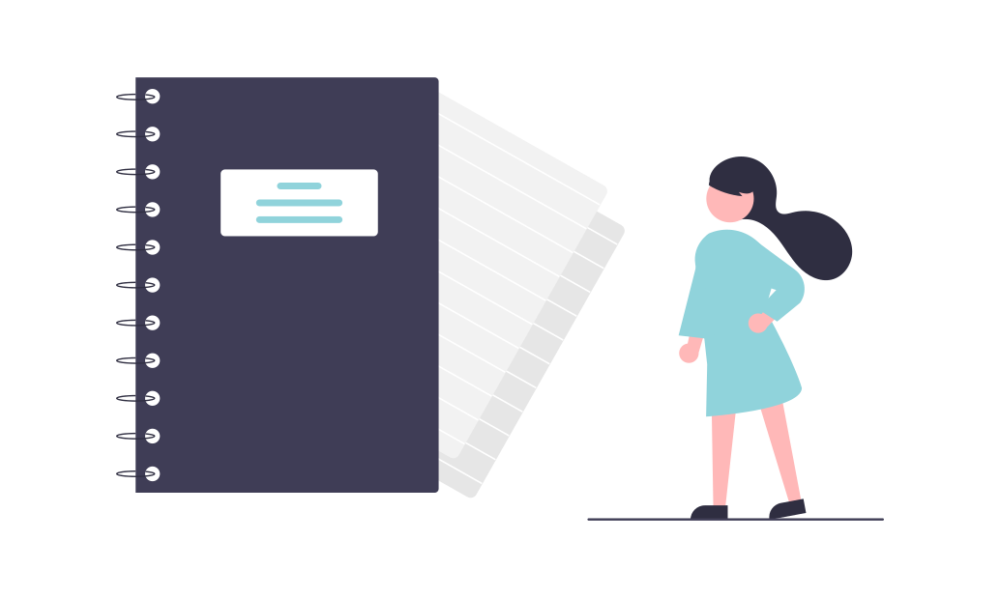

<ul class="breadcrumb">
  <li><a href="./#" class="icon fa-home">  Home</a></li>
  <li><a href="./#portfolio" class="icon fa-th">  Portfolio</a></li>
  <li>Plain English</li>
</ul>

### Context

I completed this exercise as part of a technical writing course I took in 2020 - [Become Technical Writer](https://becometechnicalwriter.com/) led by [Bobby Kennedy](https://www.linkedin.com/in/robert-b-kennedy-a2458b224/). I found out about the course from the Write the Docs' [Slack Network](https://www.writethedocs.org/slack/) where Bobby posted a call for beta testers. I was quick and lucky enough to respond and became one of the beta testers for the course. Later I also bought the course itself as I felt there was still a lot to learn (not to mention that all beta testers got a discount (: ). This exercise in translating overwritten English into plain language was part of the assignments I completed throughout the course.

I used Section 7 of Directive 024 of the State of Nevada's Declaration of Emergency ([see the full declaration here](assets/docs/Directive-Face-Coverings.pdf)) as an example of how complex expressions in English can be re-written in a simple, more understandable way.

### Original Text
		
SECTION 7: The mandatory provisions of this Directive shall not apply to:

1. 	Children who are nine years of age, or younger. Children who are two to nine years of age are strongly encouraged to wear face coverings in public spaces.
2. 	Individuals experiencing homelessness. Such individuals are encouraged to take protective measures to the greatest extent practicable.
3. 	Individuals who cannot wear a face covering due to a medical condition or disability, or who are unable to remove a mask without assistance. Persons exempted under   this provision should wear a non-restrictive alternative, such as a face shield. Persons exempted under this provision shall not be required to produce documentation verifying the condition.
4. 	Individuals for whom wearing a face covering would create a risk to the person related to their work, as determined by local, state, or federal regulators or workplace safety guidelines.
5. 	Individuals who are obtaining a service involving the nose or face for which the temporary removal of the face covering is necessary to perform that service.
6. 	Individuals who are seated at a restaurant or other establishment that offers food or beverage services, while they are eating or drinking, provided that they are able to maintain a distance of at least six feet away from persons who are not members of the same household or residence.
7. 	Individuals who are engaged in outdoor work or recreation such as swimming, walking, hiking, bicycling, or running, when alone or with household members, and when they are able to maintain a distance of at least six feet from others.
8. 	Individuals who are incarcerated. Prisons and jails, as part of their mitigation plans, will have specific guidance on the wearing of face coverings or masks for both inmates and staff.

### Instructions In Plain English Printed On a Poster
Use Case:
As the manager of Big Box Store, I need to post these directives. The poster below states who is excluded.

### Tools

- [Hemingway Editor](https://hemingwayapp.com/) to check readability grade while editing.
- [Canva](https://www.canva.com/) to create the poster. 